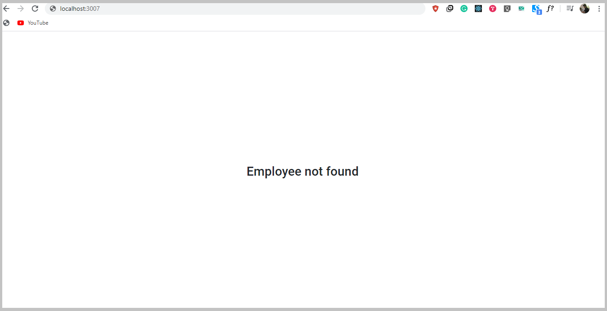
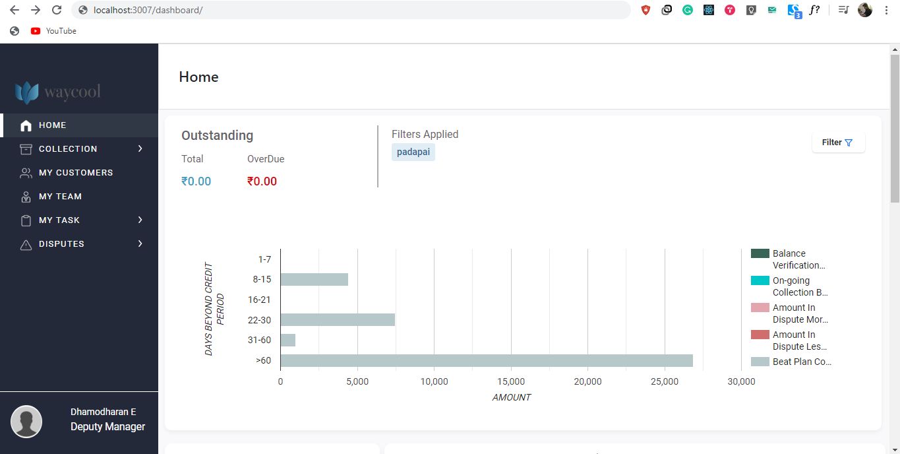

## Getting Started

You will need a working version of Node (tested with v8.10.0) and NPM to get started.

## Available Scripts

In the project directory, you can run:

```
npm install
```

The above command will download all the dependencies in a folder `node_modules`

```
npm start
```

Runs the app in the development mode.
Open http://localhost.com/3007 to view it in the browser.
The page will reload if you make edits.
You will also see any lint errors in the console.

Also you can change the `PORT` by changing `PORT=3007` inside `.env` in a root directory.

## Employee Not Found

So you must be wondering that why you are not able to access the Dashboard.



## Access Dashboard

You need to access the dashabord with a valid WayCool employee code, something like `WFP/705/19`. As the Dashboard is integrated with [OneWaycool](http://one.waycool.in/), user is suppose to land on the Receivable Dashboard with his WayCool employee code, which is suppose to be checked by Receivable Backend.

One can access the Dashboard by using `http://localhost:3007?empCode=WFP/505/19`



## Create Build

```
npm run build
```

Builds the app for production to the `/build` folder.
It correctly bundles React in production mode and optimizes the `build` for the best performance.
The build is minified and the filenames include the hashes.
Your app is ready to be deployed!

For knowing more about how to create prodution build or development build, refer to [Creating Build](doc4.md).
